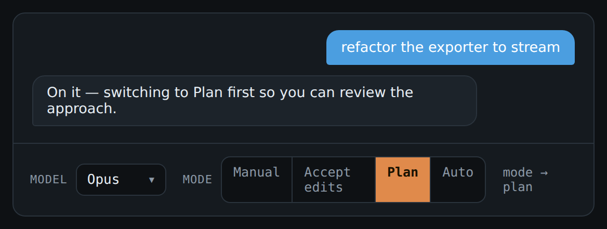
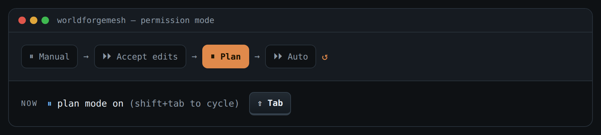

# RemoteCode

A self‑hosted web control panel for **AI coding agents running in tmux** — like a
mobile‑app cockpit for Claude Code, Aider, Codex, OpenCode, Goose, Gemini, or a
plain shell. Create sessions, type prompts, watch the conversation, see every file
being changed or generated (including **live GLB / image previews**), and drop into
a full terminal for any of them — all from your phone or browser. Switch the Claude
model or permission mode, answer interactive menus, and upload files without ever
leaving the chat.

 

## Features

- **Any agent, in tmux.** Launch a new session for any detected agent, or auto‑discover
  agents you started yourself in tmux. Rename or kill sessions from the UI.
- **Mobile‑app chat** (Claude Code): the conversation is rendered from Claude's own
  transcript — your prompts, replies, and inline "✎ Edited / ＋ Wrote" chips — with a
  prompt box that types straight into the session. The **full command** of every
  `Bash` step is shown, untruncated.
- **Model & permission mode from the chat** — pick the model from a dropdown and tap
  the permission mode; the bar reflects the model that's actually running. See
  [Model & mode](#model--mode--from-the-chat) below.
- **Answer interactive prompts** — when a session is waiting on a choice (trust folder,
  permission, plan approval, model picker), the options appear as **tap targets** in the
  chat. Plus on‑screen ↑ ↓ Enter Esc keys, and a full mobile **terminal key bar**
  (Esc ⇥ ↑ ↓ ← → ⏎ ^C) so you can drive any TUI from a phone.
- **Upload files into the chat** — attach button, drag‑and‑drop, or paste an image.
  Files are saved into the session's working directory and referenced by path in your
  prompt, so the agent can read them.
- **Files changed / generated**, live — including artifacts produced by commands
  (e.g. a `.glb` a script just exported), each with its size.
- **Preview any file type** in a **docked side panel** next to the file list:
  syntax‑highlighted code (colour scheme by language), **auto‑previewed images**,
  **interactive GLB/glTF 3D** models, or a size‑aware download card for anything else.
  Widen the panel for a bigger view.
- **Live terminal** for *any* tmux session over a websocket (xterm.js) — handle
  interactive prompts, or use agents that have no chat provider.
- **Optional auth**, off by default (see Security). Binds to `127.0.0.1`.

## Model & mode — from the chat

A control bar sits above the prompt on any Claude Code session:



- **Model** — pick from the dropdown. Most models switch **just the current session**
  (via `/config model=<name>`). **Fable** is the exception: it's set with `/model fable`,
  which also becomes your account default, so the bar flags it as *saved as default*.
  The dropdown reflects the model that's actually running (read from the transcript).
- **Permission mode** — tap **Manual**, **Accept edits**, **Plan**, or **Auto**. The
  Claude Code TUI has no "set mode" command; the only control is **Shift+Tab**, which
  advances one step around a cycle whose length varies per account. RemoteCode reads the
  on‑screen mode badge and taps Shift+Tab until it lands on your target — so a single tap
  is deterministic no matter where the cycle started:



The same badge‑reading trick powers the **interactive prompt** support: menus like the
trust check, permission requests, plan approval, and the model picker are detected from
the terminal and surfaced as tap targets, then driven with arrow keys + Enter.

## Quick start

```bash
git clone https://github.com/<you>/RemoteCode.git
cd RemoteCode
./install.sh            # installs tmux if missing, sets up a venv + deps
./run.sh                # serves http://127.0.0.1:7070/
```

Install as a background service instead:

```bash
./install.sh --service  # writes/enables a systemd unit (remotecode.service)
```

Open <http://127.0.0.1:7070/>. Tap **＋** to start a session: pick an agent, then a
directory. That's it.

> Requires Python 3.9+, Linux (reads `/proc` and `~/.claude` for the rich Claude view),
> and `tmux` (installed for you by `install.sh`). The 3D viewer, syntax highlighter and
> terminal are all **vendored** in `static/vendor/` — no CDN, works fully offline.

## Configuration (env vars)

| Variable | Default | Meaning |
|---|---|---|
| `REMOTECODE_HOST` | `127.0.0.1` | bind address |
| `REMOTECODE_PORT` | `7070` | bind port |
| `REMOTECODE_PROJECTS` | auto | comma list of dirs or `key=dir` pairs offered as working dirs. Auto‑discovered from `~/.claude.json` if unset. |
| `REMOTECODE_PASSWORD` | *(unset → no auth)* | set to require basic‑auth (`admin` / this value) |
| `REMOTECODE_USER` | `admin` | basic‑auth username |

Agents are defined in `config.py` and detected via `PATH`; override with
`~/.config/remotecode/agents.json`.

## The Claude "provider"

When a session runs **Claude Code**, RemoteCode reads Claude's own on‑disk data
(`~/.claude/sessions`, `~/.claude/projects/*/*.jsonl`) to render the chat and the
files‑changed list — no extra integration needed. Other agents get the terminal view
(everything still works: create, rename, attach, kill). Adding a provider for another
agent is just a new parser in `claude_data.py`‑style module.

## Security

RemoteCode can spawn shells and attach to terminals, so treat it like SSH:

- It binds `127.0.0.1` by default. Reach it over a VPN / **Tailscale**, or an SSH tunnel.
- Auth is **optional and off by default**. Before exposing it beyond localhost, set
  `REMOTECODE_PASSWORD` (built‑in basic‑auth) **and/or** front it with the TLS reverse
  proxy in `nginx.conf.example`.
- Never put it on the public internet without auth + TLS.

## How it works

- `app.py` — FastAPI backend: session discovery from tmux + `/proc`, create/rename/kill,
  prompt via `tmux send-keys`, SSE transcript stream, file preview/raw, and a PTY
  websocket (`tmux attach`) for the terminal.
- `claude_data.py` — parses Claude's transcript into chat items + changed files.
- `config.py` — agents, projects, auth.
- `static/` — single‑page UI (vanilla JS) with vendored xterm.js, highlight.js and
  `<model-viewer>`.

## License

MIT — see [LICENSE](LICENSE).
